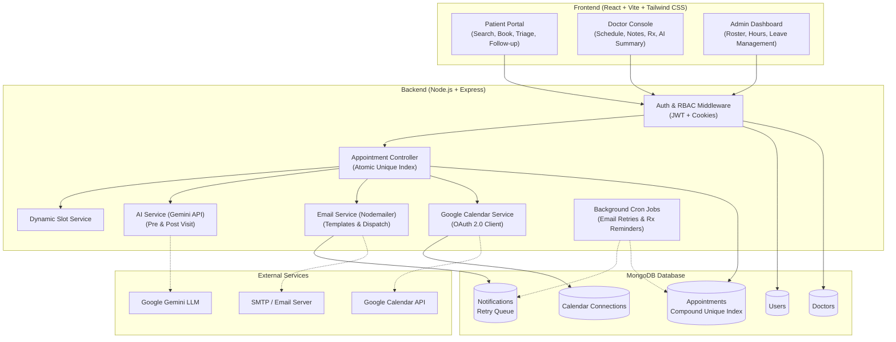

# CareSync | Healthcare Appointment & Follow-up Manager

CareSync is a full-stack MERN healthcare appointment management web platform designed to streamline outpatient scheduling, clinical triage, digital consultations, and post-visit patient follow-ups.

---

## 🌟 Project Overview

Traditional healthcare scheduling platforms often suffer from concurrency race conditions (double-booking), manual administrative overload during doctor leaves, communication gaps in symptom triage, and complex medical jargon that confuses patients after visits.

**CareSync solves these challenges by providing:**
1. **Concurrency Protection**: Database-enforced atomic slot booking guaranteeing zero double-booking under concurrent load.
2. **Dynamic Slot Engine**: Real-time available slot generation considering working hours, slot durations, operating days, active bookings, and scheduled leaves.
3. **AI Clinical Assistant (Google Gemini)**: Pre-visit symptom triage and patient-friendly post-visit medication and care explanations.
4. **Resilient Notification Subsystem (Nodemailer + `node-cron`)**: Decoupled asynchronous email dispatch with automated retry queues for transient failures.
5. **Automated Doctor Leave Conflict Resolution**: Instant automated cancellation, patient notification, and calendar cleanup when physician leaves are scheduled.
6. **Google Calendar Sync**: Two-way OAuth2 synchronization for calendar event creation and reminders.

---

## 🏗 Architecture Diagram



---

## 💻 Tech Stack

- **Frontend**: React 18, Vite, JavaScript, Tailwind CSS, React Router DOM v6, Axios, Lucide React Icons.
- **Backend**: Node.js, Express.js, MongoDB, Mongoose, JWT, bcryptjs, cookie-parser, dotenv, cors, helmet, morgan.
- **AI Integration**: Google Gemini API (`@google/generative-ai`) for Pre-visit Triage & Post-visit Summary.
- **Email Notifications**: Nodemailer (supports SMTP / simulated test mode with rich HTML templates).
- **Calendar Integration**: Google Calendar API & Google OAuth 2.0 (`googleapis`).
- **Background Jobs**: `node-cron` for automated email retry queues and daily medication reminders.

---

## 🔑 Test Credentials (Seed Accounts)

Run `npm run seed` to populate the database with these ready-to-test accounts:

| Role | Email | Password | Details |
| :--- | :--- | :--- | :--- |
| **Admin** | `admin@example.com` | `Admin@123` | Full administrative control |
| **Patient** | `patient@example.com` | `Patient@123` | John Doe (Sample booked visits) |
| **Doctor** | `rahul.sharma@example.com` | `Doctor@123` | Dr. Rahul Sharma (Cardiologist) |
| **Doctor** | `priya.singh@example.com` | `Doctor@123` | Dr. Priya Singh (Dermatologist) |
| **Doctor** | `amit.verma@example.com` | `Doctor@123` | Dr. Amit Verma (General Physician) |

---

## 🚀 Quick Start & Installation

### 1. Clone & Install Dependencies
```bash
# Clone the repository
git clone <repository-url>
cd Healthcare_Appointment

# Install all dependencies (Root, Server, Client)
npm run install:all
```

### 2. Environment Configuration
Create a `.env` file in the root directory (or copy from `.env.example`):
```bash
cp .env.example .env
```

Ensure `.env` contains:
```env
PORT=5000
MONGODB_URI=mongodb://127.0.0.1:27017/healthcare_appointment
JWT_SECRET=your_super_secret_jwt_key_here_change_in_production
JWT_EXPIRES_IN=7d

# Google Gemini AI (Optional - falls back gracefully if unset)
GEMINI_API_KEY=your_gemini_api_key_here

# Nodemailer SMTP Configuration (Optional - simulated in console if unset)
SMTP_HOST=smtp.gmail.com
SMTP_PORT=587
SMTP_USER=your_email@gmail.com
SMTP_PASSWORD=your_app_specific_password
EMAIL_FROM="HealthCare Appointments" <noreply@healthcare.com>

# Google Calendar OAuth 2.0 (Optional - falls back gracefully if unset)
GOOGLE_CLIENT_ID=your_google_client_id.apps.googleusercontent.com
GOOGLE_CLIENT_SECRET=your_google_client_secret
GOOGLE_REDIRECT_URI=http://localhost:5000/api/calendar/google/callback

# Frontend URL
CLIENT_URL=http://localhost:5173
```

### 3. Seed Database
```bash
npm run seed
```

### 4. Run Development Server
```bash
# Runs backend on :5000 and frontend on :5173 concurrently
npm run dev
```

Open your browser at `http://localhost:5173`.

### 5. Run Automated Test Suite
```bash
npm test
```

---

## 🗄 Database Schema

### 1. `User`
- `name` (String, required)
- `email` (String, unique, lowercase, required)
- `password` (String, hashed with bcrypt, select: false)
- `role` (Enum: `['patient', 'doctor', 'admin']`, default: `'patient'`)
- `phone` (String)
- `createdAt`, `updatedAt`

### 2. `Doctor`
- `userId` (ObjectId ref User, unique, required)
- `name` (String, required)
- `email` (String, required)
- `specialisation` (String, indexed)
- `bio` (String)
- `workingDays` (Array: `['Monday', 'Tuesday', ...]`)
- `startTime` (String format `HH:mm`, default: `'09:00'`)
- `endTime` (String format `HH:mm`, default: `'17:00'`)
- `slotDuration` (Number in minutes, default: `30`)
- `leaveDates` (Array of `{ date: String, reason: String }`)
- `isActive` (Boolean, default: `true`)

### 3. `Appointment`
- `patientId` (ObjectId ref User, required)
- `doctorId` (ObjectId ref Doctor, required)
- `date` (String format `YYYY-MM-DD`, required)
- `startTime` (String format `HH:mm`, required)
- `endTime` (String format `HH:mm`, required)
- `status` (Enum: `['BOOKED', 'COMPLETED', 'CANCELLED', 'RESCHEDULED']`, default: `'BOOKED'`)
- `symptoms` (String, required)
- `preVisitSummary` (`{ urgencyLevel, chiefComplaint, suggestedQuestions }`)
- `urgencyLevel` (Enum: `['Low', 'Medium', 'High', 'Unknown']`)
- `visitNotes` (String)
- `prescription` (Array of `{ medicine, dosage, frequency, duration, instructions }`)
- `postVisitSummary` (String)
- `calendarEventId` (String)
- **Compound Index**: `{ doctorId: 1, date: 1, startTime: 1 }` (unique for active appointments)

### 4. `Notification`
- `userId` (ObjectId ref User, required)
- `recipientEmail` (String, required)
- `type` (Enum: `['BOOKING_CONFIRMATION', 'CANCELLATION', 'RESCHEDULE', 'REMINDER', 'MEDICATION_REMINDER', 'LEAVE_NOTICE']`)
- `subject` (String, required)
- `message` (String HTML/text, required)
- `status` (Enum: `['PENDING', 'SENT', 'FAILED']`)
- `retryCount` (Number, default: 0)

### 5. `CalendarConnection`
- `userId` (ObjectId ref User, unique)
- `accessToken` (String, secure)
- `refreshToken` (String, secure)
- `expiryDate` (Number)
- `googleEmail` (String)

---

## 📡 API Endpoints Reference

### Authentication (`/api/auth`)
- `POST /api/auth/register` — Register patient or doctor
- `POST /api/auth/login` — Login user, return JWT and set cookie
- `POST /api/auth/logout` — Clear session cookie
- `GET /api/auth/me` — Get current authenticated user profile

### Doctors (`/api/doctors`)
- `GET /api/doctors` — Public search and specialty filter
- `GET /api/doctors/:id` — Get doctor public profile
- `POST /api/doctors` — Admin: Create new doctor
- `PATCH /api/doctors/:id` — Admin/Doctor: Update profile, hours, slot duration
- `DELETE /api/doctors/:id` — Admin: Deactivate doctor
- `GET /api/doctors/:id/slots?date=YYYY-MM-DD` — Dynamic available slot calculation
- `POST /api/doctors/:id/leave` — Admin/Doctor: Add leave date & auto-cancel conflicts
- `DELETE /api/doctors/:id/leave/:leaveId` — Admin/Doctor: Remove scheduled leave

### Appointments (`/api/appointments`)
- `POST /api/appointments` — Book appointment with AI pre-visit triage
- `GET /api/appointments` — List role-scoped appointments
- `GET /api/appointments/:id` — Get single appointment details
- `PATCH /api/appointments/:id/reschedule` — Reschedule date/time
- `POST /api/appointments/:id/cancel` — Cancel appointment
- `POST /api/appointments/:id/notes` — Doctor: Add clinical notes
- `POST /api/appointments/:id/prescription` — Doctor: Add medication items
- `POST /api/appointments/:id/complete` — Doctor: Finalize consultation & trigger post-visit AI summary

### Google Calendar (`/api/calendar`)
- `GET /api/calendar/google` — Get Google OAuth consent URL
- `GET /api/calendar/google/callback` — OAuth callback handler
- `GET /api/calendar/status` — Get connection status
- `DELETE /api/calendar/google` — Disconnect Google Calendar

### Admin (`/api/admin`)
- `GET /api/admin/stats` — Platform metrics & recent appointments

---

## 🤖 AI Prompts (Google Gemini API)

### 1. Pre-Visit Symptom Summary & Triage Prompt
```text
You are assisting a healthcare professional.

Analyze the symptoms provided by the patient.

Do NOT diagnose the patient.
Do NOT prescribe medication.
Do NOT invent information.

Return a JSON object with:

{
  "urgencyLevel": "Low | Medium | High",
  "chiefComplaint": "short summary",
  "suggestedQuestions": [
    "question 1",
    "question 2",
    "question 3"
  ]
}

Urgency should only reflect the information provided by the patient.

If symptoms may require urgent medical attention, mark the urgency as High and clearly indicate that the doctor should assess the patient promptly.

Patient symptoms:
{{SYMPTOMS}}
```

### 2. Post-Visit Patient-Friendly Summary Prompt
```text
You are helping convert a doctor's clinical notes into a simple patient-friendly visit summary.

Do NOT change the doctor's instructions.
Do NOT invent medication.
Do NOT change dosage or frequency.
Do NOT provide a new diagnosis.

Clearly explain:

1. What the doctor discussed
2. Important instructions
3. Medication schedule exactly as prescribed
4. Follow-up steps

Use simple language that a patient can understand.

Doctor's clinical notes:
{{NOTES}}

Prescription:
{{PRESCRIPTION}}
```

---

## 📅 Google Calendar Setup Guide

To enable live Google Calendar synchronization:
1. Go to [Google Cloud Console](https://console.cloud.google.com/).
2. Create a new project (e.g. `CareSync Healthcare`).
3. Navigate to **APIs & Services** > **Library** and enable the **Google Calendar API**.
4. Configure the **OAuth Consent Screen** (User type: External, add your test email as Test User).
5. Go to **Credentials** > **Create Credentials** > **OAuth client ID** (Application type: Web application).
6. Add Authorized redirect URI: `http://localhost:5000/api/calendar/google/callback`.
7. Copy the generated `Client ID` and `Client Secret` into your `.env` file (`GOOGLE_CLIENT_ID` and `GOOGLE_CLIENT_SECRET`).

*Note: If Google Calendar credentials are not configured, the application functions normally and displays a friendly "Google Calendar is not connected" status.*

---

## 📐 System Design Decisions

### 1. Double Booking Prevention
Under high-concurrency environments, application-level availability checks (`isSlotAvailable`) are vulnerable to race conditions (Time-of-Check to Time-of-Use). CareSync implements database-level concurrency protection using a MongoDB compound unique partial index on `Appointment`:
```javascript
{ doctorId: 1, date: 1, startTime: 1 }
```
with `partialFilterExpression: { status: { $in: ["BOOKED", "COMPLETED", "RESCHEDULED"] } }`. 
When two concurrent requests attempt to reserve the same slot, MongoDB's atomic index write guarantees that the first transaction succeeds while the second fails with duplicate key error code `11000`. The centralized Express error handler catches this code and returns a clear `HTTP 409 Conflict` (`"This slot has already been booked."`). The partial index ensures cancelled slots are immediately released for legitimate re-booking without collision.

### 2. Dynamic Slot Generation & Slot Holds
Rather than bloating the database with thousands of pre-generated empty slot rows, CareSync calculates slots on-demand by synthesizing doctor working hours (`startTime`, `endTime`), `slotDuration` (e.g. 30 mins), active `workingDays`, scheduled `leaveDates`, and existing active appointments. If temporary slot holding during checkout is required in the future, a lightweight Redis TTL key (e.g. `hold:docId:date:slot` expiring in 5 minutes) can be introduced without altering core database schemas.

### 3. Doctor Leave Conflict Resolution
When an administrator or physician registers a scheduled leave date:
1. The system updates the doctor's `leaveDates` array.
2. An automated query immediately identifies all active `BOOKED` appointments on that date.
3. Identified appointments are transitioned to `CANCELLED`.
4. Linked Google Calendar events are deleted via Google Calendar API.
5. Automated personalized cancellation emails are dispatched to affected patients explaining the physician's leave.
6. The administrator receives a summary count of all affected bookings.

### 4. Notification Subsystem Resilience
Email notifications and calendar synchronization are strictly decoupled from appointment booking and completion transactions. CareSync follows the "Save to DB first, attempt notification asynchronously" pattern. If an email dispatch fails due to transient network or SMTP timeouts, the appointment remains successfully booked; the error is logged and a notification record is saved with `status: 'FAILED'` and `retryCount: 0`. A background cron job (`node-cron`) periodically processes failed notifications with exponential retry limits (max 3 attempts).

### 5. LLM Failure Resilience
AI is treated strictly as an enhancement rather than a hard dependency. When calling Google Gemini for pre-visit triage or post-visit summaries, all external API calls are wrapped in defensive try-catch handlers. If the API key is missing, network fails, or Gemini returns malformed output, the pre-visit triage defaults safely to `{ urgencyLevel: "Unknown", chiefComplaint: "..." }` and post-visit summaries default to standard physician review text. Consultations and bookings proceed uninterrupted.

---

## 🧪 Testing Checklist

- [x] Register new patient account
- [x] Login as Patient, Doctor, and Admin
- [x] Admin creates and edits doctor profiles with custom shifts
- [x] Patient searches doctors by keyword and filters by specialization
- [x] Dynamic slot generation filters out booked slots and non-working days
- [x] Patient books appointment with symptoms & AI pre-visit triage
- [x] Concurrent booking on identical slot returns HTTP 409 Conflict
- [x] Doctor views today's schedule and opens consultation workspace
- [x] Doctor enters clinical notes, builds dynamic prescriptions, and completes consultation
- [x] Patient-friendly AI summary generated and stored on appointment
- [x] Admin adds doctor leave date -> conflicting appointments auto-cancelled & notified
- [x] Google Calendar connect/disconnect status handling
- [x] Email notification retry background job and medication reminders

---

## 📄 License

MIT License &copy; 2026 CareSync Healthcare Management.
